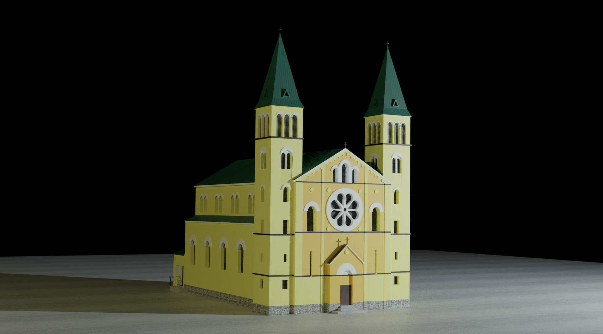
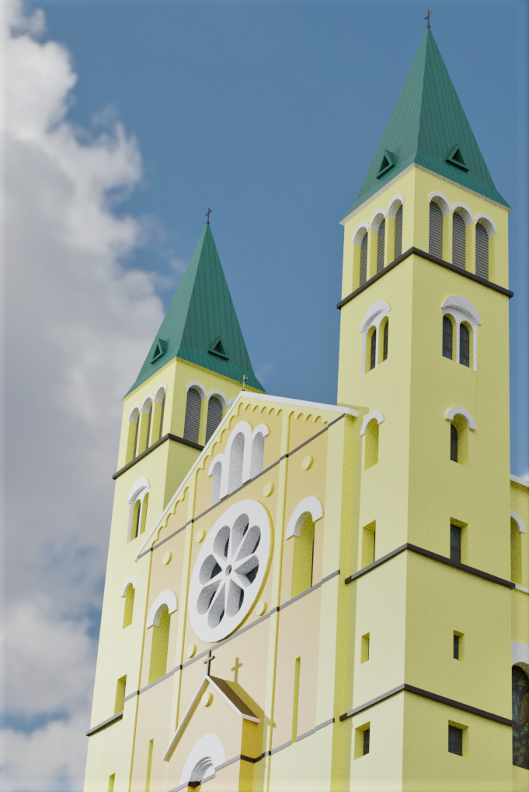

# About the Project

<a href="https://www.google.com/maps/place/Crkva+Svetog+Mihovila/@44.1618372,18.3268615,15z/data=!4m6!3m5!1s0x475ed6974e07690d:0xc72eb604e1229ccb!8m2!3d44.1618372!4d18.3268615!16s%2Fg%2F11bxc6d1yc?entry=ttu">St. Michael's Church</a> AR is an application created in Unity3D that recognizes the image of St. Michael's 
Church and displays a 3D model of the church along with three additional objects: a Bible, a bell, and a statue of St. Michael. 
Each of these additional objects offers users specific graphic or audio content when selected. St. Michael's church model was created in Blender.

# Demonstration

  
https://github.com/mkokor/church-of-saint-michael-ar/assets/126569077/7543d3d8-dac4-428b-9818-558535310eae

# Church Model Images

  

  

